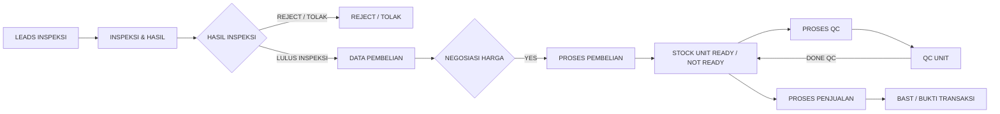

# 04 — BOZZMOBIL Business Flow

Visual reference: `images/BOZZMOBIL_FLOWCHART.png`

```mermaid
flowchart LR
    A[LEADS INSPEKSI] --> B[INSPEKSI & HASIL]
    B --> C{HASIL INSPEKSI}
    C -->|REJECT / TOLAK| D[REJECT / TOLAK]
    C -->|LULUS INSPEKSI| E[DATA PEMBELIAN]
    E --> F{NEGOSIASI HARGA}
    F -->|YES| G[PROSES PEMBELIAN]
    G --> H[STOCK UNIT READY / NOT READY]
    H --> I[PROSES QC]
    I --> J[QC UNIT]
    J -->|DONE QC| H
    H --> K[PROSES PENJUALAN]
    K --> L[BAST / BUKTI TRANSAKSI]
```

Flow chart menggambarkan proses bisnis. Database constraint tetap mengikuti `02_FINAL_ERD.md` dan `schema.sql`.
